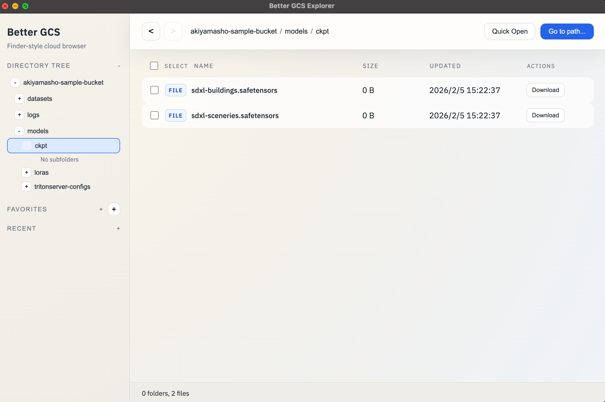
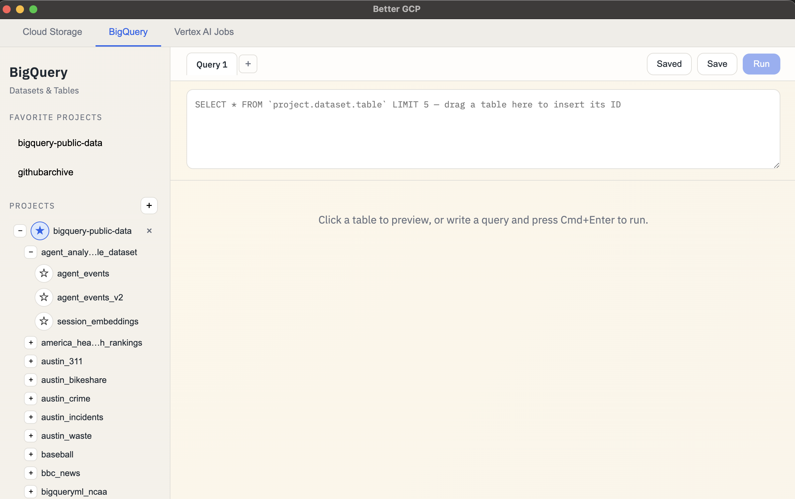
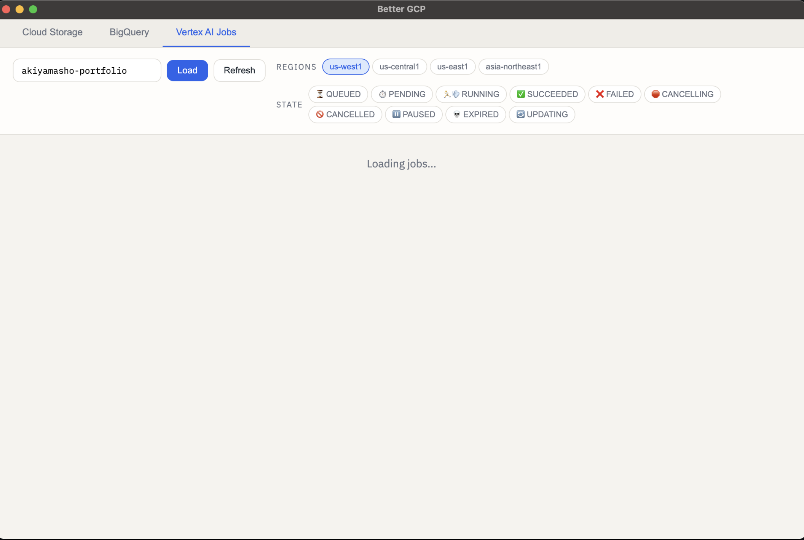

# Changelog

All notable changes to this project will be documented in this file.

## [4.2.0] - 2026-04-03

### Added
- **Compute Engine tab** — browse GCE VM instances across multiple projects and zones.
  - Multi-project support with toggleable dropdown (add/remove projects, persisted across sessions).
  - Searchable zone selector with all GCP zones (us-west1-a, us-central1-a, asia-northeast1-a, etc.).
  - Instance list with status (RUNNING, STOPPED, etc.), machine type, internal/external IPs, and creation time.
  - Detail panel with network interfaces, disks, scheduling, metadata, labels, tags, service account, and OAuth scopes.
  - Direct links to GCP Console (instance details) and Cloud Logging (filtered by instance ID).
  - Jump to instance modal (`Cmd+Shift+O`) with regex search across loaded instances.
  - Filter bar to search by name, project, zone, machine type, or IP address.

## [4.1.1] - 2026-03-21

### Fixed
- **Region selections now persist** across app restarts — each tab (AI Jobs, AI Pipelines, Cloud Run) saves its selected regions to localStorage. Custom regions added via the dropdown also persist.

## [4.1.0] - 2026-03-21

### Added
- **Searchable region dropdown** across all tabs (AI Jobs, AI Pipelines, Cloud Run) — replaces static region chips with a searchable multi-select dropdown supporting all GCP regions. Type to filter, click to toggle, add custom regions on the fly.
- Shared `RegionSelect` component used by all tabs for consistent UX.

## [4.0.1] - 2026-03-21

### Fixed
- **Cloud Run project selector** — replaced one-shot chips with a toggleable dropdown. Previously added projects stay in the list and can be enabled/disabled without re-typing. Add new projects inline from the same dropdown.

## [4.0.0] - 2026-03-20

### Added
- **Cloud Run tab** — browse Cloud Run services across multiple projects and regions.
  - Multi-project support with add/remove project chips (persisted across sessions).
  - Service list with status, URL, project, region, and creation time.
  - Detail panel with container config (image, port, CPU, memory), scaling (min/max instances), traffic split, conditions, environment variables, and labels.
  - Direct links to GCP Console (monitoring), Cloud Logging (filtered by service and region), and Revisions.
  - Jump to service modal (`Cmd+Shift+O`) with regex search across loaded services.
  - Filter bar to search by name, project, region, or container image.
- **Tab palette** (`Cmd+Shift+P`) — quickly switch between tabs by typing (autocomplete).

### Changed
- Renamed **Vertex AI Jobs** tab to **AI Jobs**.
- Renamed **Pipelines** tab to **AI Pipelines**.
- **Jump shortcut** within tabs is now `Cmd+Shift+O` (was `Cmd+Shift+P` in BigQuery).
- **Go to Path** in Cloud Storage is now `Cmd+Shift+G` (was `Cmd+Shift+P`).
- Updated AGENTS.md and CLAUDE.md with Cloud Run docs, updated file structure, and full release workflow with Slack notification.

## [3.6.0] - 2026-03-19

### Added
- **Node Logs button** in Pipelines DAG view — click a node and open Cloud Logging filtered to that specific task (not the full pipeline).
- **Refresh button** in Pipelines DAG toolbar — manually refresh the pipeline state at any time.
- **Auto-refresh** for active pipelines — DAG view automatically polls every 15 seconds while the pipeline is running/queued/pending.

## [3.5.0] - 2026-03-19

### Added
- **Vertex AI Pipelines tab** — monitor pipeline runs with an interactive DAG visualization.
  - Top-to-bottom DAG layout with pan/zoom canvas and minimap for navigation.
  - Segmented progress bar showing step completion with per-task state coloring.
  - Status badge icons (checkmark, X, animated spinner) on each node.
  - Artifact count badges and flow indicators on edges.
  - Right panel with "Pipeline Summary" and "Node Details" tabs.
  - Fit-to-view button for auto-framing the entire graph.
  - Pipeline list view with region/state filtering, batch cancel/delete, pagination.
  - Runtime parameters summary, direct links to GCP Console and Cloud Logging.
- **GCS project-based browsing** — enter any project ID in the sidebar to browse its buckets (persisted across sessions).

### Changed
- Updated AGENTS.md and CLAUDE.md with comprehensive agent onboarding docs and best practices.

## [3.3.0] - 2026-03-18

### Improved
- **Batch cancel for Vertex AI Jobs** — cancel active jobs (Queued, Pending, Running) from any mixed selection; non-active jobs are skipped automatically.
- Cancel and Delete buttons now show the count of affected jobs (e.g. "Cancel (3)") and are independently enabled based on the selection contents.

### Fixed
- **Create folder in GCS tab** — replaced `window.prompt` (broken in packaged Electron) with a proper in-app modal dialog.

## [3.2.1] - 2026-03-10

### Fixed
- Dark mode contrast for Vertex AI Jobs tab — brighter state badges, readable table text, and fixed hardcoded white backgrounds on buttons and worker pool cards.

## [3.2.0] - 2026-03-10

### Added
- **Favorite datasets** in the BigQuery tab — star datasets in the tree to pin them to the sidebar for quick access.

## [3.1.0] - 2026-03-07

### Added
- Theme setting in service header with `System` (default), `Light`, and `Dark` modes.
- Global service switching with `Cmd/Ctrl+Tab` and reverse cycling with `Cmd/Ctrl+Shift+Tab`.

### Changed
- Service tabs are now kept mounted while switching, preserving each tab's UI state.
- Added dark-mode styling across Cloud Storage, BigQuery, and Vertex AI views.

## [3.0.1] - 2026-03-07

### Changed
- Updated screenshot assets for all service tabs.

### Screenshots

## [3.0.0] - 2026-03-07

### Added
- **Vertex AI Jobs tab** for monitoring Custom Jobs across supported regions.
- Region and job-state filters with newest-first sorting.
- Bulk actions to cancel active jobs and delete completed jobs.
- Job detail pane with worker pool specs, machine/accelerator config, container image, and environment variables.
- Quick links to GCP Console and Cloud Logs per job.
- Pagination with per-region "Load more" controls.

## [2.0.1] - 2026-02-25

### Fixed
- Detect active `gcloud` project ID in packaged macOS app.

## [2.0.0] - 2026-02-25

### Added
- **BigQuery tab** with sidebar tree for browsing projects, datasets, and tables.
- Query editor with tab management, `Cmd/Ctrl+Enter` to run, save/load queries.
- Table preview (LIMIT 5) on click.
- Quick Jump (`Cmd/Ctrl+Shift+P`) with regex search across loaded tables and datasets.
- Favorite projects and favorite tables, pinned to the top of the sidebar.
- Manually add projects with access validation (shows error if inaccessible).
- Drag-and-drop tables from sidebar into query editor to insert fully-qualified table ID.
- Right-click context menu on tables: copy dataset ID, copy backtick-quoted ID, insert into editor.
- Excel-like results grid with cell selection (click, shift-click, drag), keyboard navigation (arrow keys, Tab), copy (`Cmd/Ctrl+C` as TSV), and select all (`Cmd/Ctrl+A`).
- Smart cell rendering: image URLs display as inline thumbnails, regular URLs as clickable links opening in system browser.
- Service tab switcher at the top to switch between Cloud Storage and BigQuery.

### Changed
- Renamed project from "Better GCS Explorer" to "Better GCP".
- Sidebar is now independently scrollable with long dataset/table names middle-truncated (start...end) and full name on hover.

### Fixed
- `make dev` now works on Apple Silicon Macs (fixed `ELECTRON_RUN_AS_NODE` env var leak and IPv4/IPv6 localhost mismatch).

## [1.1.0] - 2026-02-05
### Added
- Batch selection bar with download/delete actions and select-all toggle.
- Per-row download button and file-only delete actions.
- Quick Open keyboard navigation (up/down + enter).
- Create-folder action in empty-space context menu.

## [1.0.0] - 2026-02-05
### Added
- Finder-like GCS browsing with breadcrumbs and directory tree.
- Favorites, recents, quick open, and go-to-path modal.
- Context menu actions for path/gsutil commands.
- Drag-and-drop upload and drag-out download.
- Local packaging and GitHub Actions release workflow.
